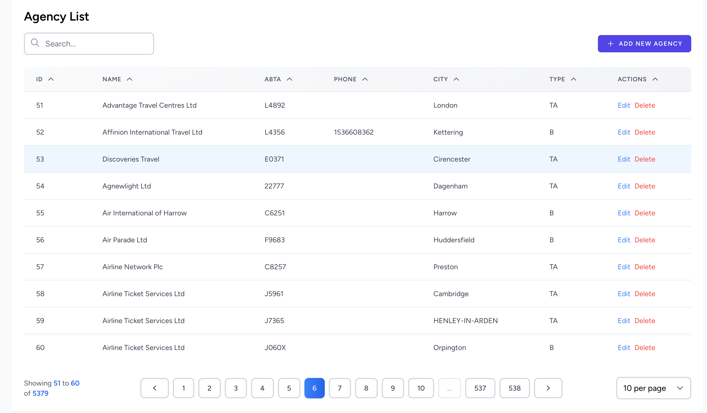
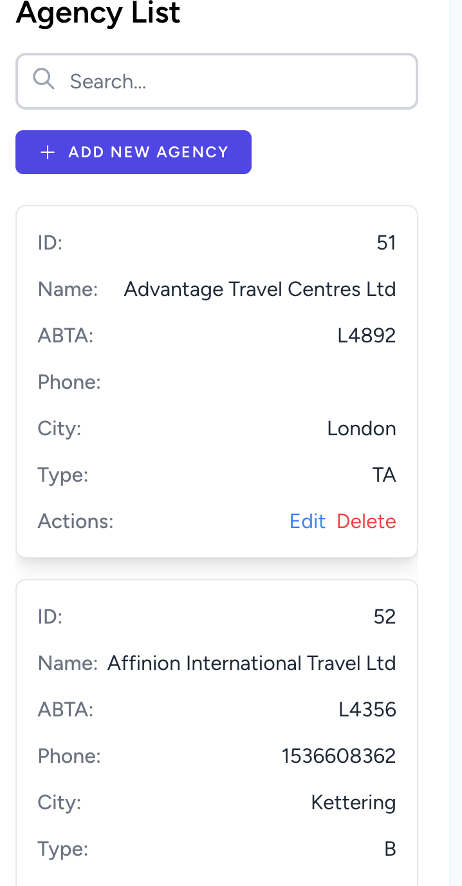

# Vue 3 Laravel Table

A flexible and customizable data table component for Vue 3 and Laravel applications, built specifically for Laravel pagination with search, sort, and filtering capabilities. Designed to work seamlessly with Inertia.js.

## Screenshots

### Desktop View


## Mobile View



## Features

- Responsive design with desktop and mobile views
- Dark mode support
- Debounced search functionality
- Sort columns by clicking headers
- Customizable items per page
- Preserves state and scroll position during navigation
- Built-in loading states
- Tailwind CSS styling with smooth transitions

## Installation

```
npm install vue3-lara-table
```

## Basic Usage

```vue
<script lang="ts" setup>
import AuthenticatedLayout from '@/Layouts/AuthenticatedLayout.vue';
import type { PaginatedResponse } from '@/vue3-lara-table/types.d.ts';
import { PlusIcon } from '@heroicons/vue/24/outline';
import { Head, Link } from '@inertiajs/vue3';
import { PropType, ref } from 'vue';

const props = defineProps({
    agencies: Object as PropType<PaginatedResponse<App.Data.AgencyData>>
});

const columns = ref([
    {
        key: 'id',
        label: 'ID',
        width: '100px',
    },
    {
        key: 'name',
        label: 'Name',
        width: '200px',
    },
    {
        key: 'abta',
        label: 'ABTA',
        width: '100px',
    },
    {
        key: 'phone',
        label: 'Phone',
        width: '150px',
    },
    {
        key: 'city',
        label: 'City',
        width: '150px',
    },
    {
        key: 'atype',
        label: 'Type',
        width: '100px',
    },
    {
        key: 'actions',
        label: 'Actions',
        width: '100px',
    },
]);
</script>
<template>
   <LaraTable :columns="columns" :items="props.agencies" searchKey="name">
                <template #add-item>
                    <Link :href="route('enquiries.agencies.create')"
                        class="inline-flex items-center px-4 py-2 bg-indigo-600 border border-transparent rounded-md font-semibold text-xs text-white uppercase tracking-widest hover:bg-indigo-700 focus:bg-indigo-700 active:bg-indigo-900 focus:outline-none focus:ring-2 focus:ring-indigo-500 focus:ring-offset-2 transition ease-in-out duration-150">
                    <PlusIcon class="w-4 h-4 mr-2" />
                    Add New Agency
                    </Link>
                </template>

                <template #actions="{ item } : { item: App.Data.AgencyData }">
                    <div class="flex gap-2">
                        <Link :href="route('enquiries.agencies.edit', item.id)"
                            class="text-blue-500 hover:text-blue-700">
                        Edit
                        </Link>
                        <Link :href="route('enquiries.agencies.destroy', item.id)"
                            class="text-red-500 hover:text-red-700">
                        Delete
                        </Link>
                    </div>
                </template>
            </LaraTable>
</template>
```

## Props

| Prop | Type | Required | Description |
|------|------|----------|-------------|
| items | PaginatedResponse<T> | Yes | Laravel paginated data |
| columns | TableColumn[] | Yes | Array of column definitions |
| searchKey | string | Yes | Key to use for search filtering |
| searchPlaceholder | string | No | Placeholder text for search input |
| enableAddItem | boolean | No | Show/hide add item button |

## Column Properties

| Property | Type | Required | Description |
|----------|------|----------|-------------|
| key | string | Yes | Column identifier |
| label | string | Yes | Column header text |
| width | string | No | Column width (e.g., '100px', '20%') |

## Slots

The component provides several customizable slots:

- `add-item`: Custom add item button template
- `[column.key]`: Custom column content template
- `actions`: Custom actions column template

Example with custom slots:

## Laravel Backend Integration

Example Laravel controller using Spatie Query Builder:

```php
use Spatie\QueryBuilder\QueryBuilder;
use Spatie\QueryBuilder\AllowedFilter;

public function index(Request $request)
{
    return Inertia::render('Enquiries/AgenciesList', [
            'agencies' => AgencyData::collect(QueryBuilder::for(Agency::class)
                ->allowedSorts(['name', 'city', 'atype', 'abta', 'phone'])
                ->allowedFilters([
                    AllowedFilter::callback('name', function ($query, $value) {
                        $query->where('name', 'like', '%' . $value . '%');
                    }),
                ])
                ->paginate(request()->get('per_page', 10)))
        ]);
}
```

## License

MIT License

## Contributing

Contributions are welcome! Please feel free to submit a Pull Request.
```

This documentation provides a comprehensive overview of the component, including:
- Features
- Installation instructions
- Basic usage example
- Available props
- Column configuration
- Events and slots
- Example with custom templates
- Backend integration guide
- License and contribution information

You can customize this further based on your specific component implementation and additional features.

